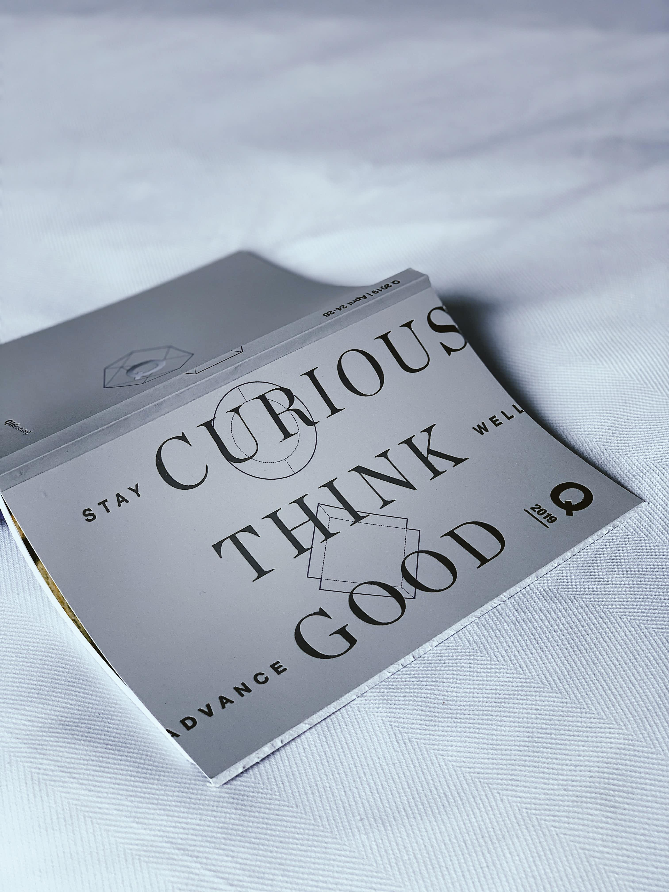
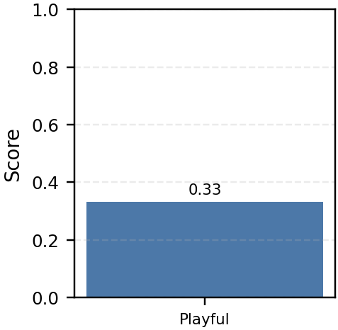
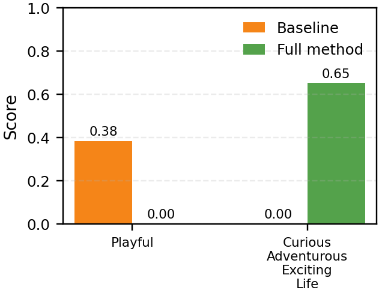
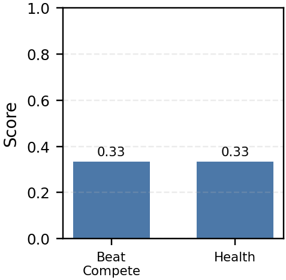
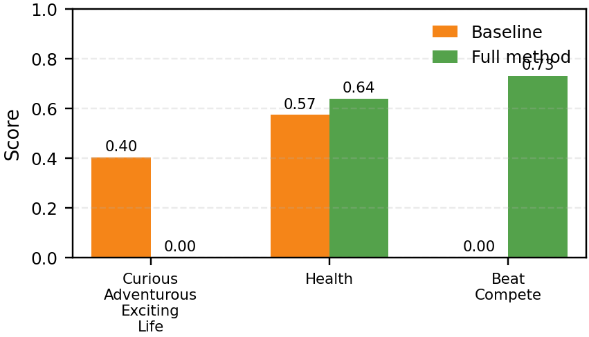

# Samples

Prediction rows below are aligned with the current streamlit browser outputs after class-wise thresholding. `Top-5 Scenario Prior` refers to the scenario-only prior and may differ from the browser's fused lexical+canonical+scenario prior table.

## 1. Baseline对，SADIR错，但SADIR也合理







- Image ID: `17be806f011d07b3edbea0afca9fe93f`
- Original Image: `/home/evelynmuir/lambda/projects/IntentRecognition/Intentonomy/data/images/low/17be806f011d07b3edbea0afca9fe93f.jpg`
- Soft Probability:
  `Playful=0.333`
- Baseline Prediction:
  `Playful=0.384`
- Full Method Prediction:
  `CuriousAdventurousExcitingLife=0.652`
- Top-5 Scenario Prior:
  `SuccInOccupHavGdJob=1.162, Happy=1.147, ManagableMakePlan=1.025, ShareFeelings=0.926, SocialLifeFriendship=0.675`
- Rationale:

```text
### Step 1: Visual Evidence
The image shows a card with the text "STAY CURIOUS THINK GOOD" prominently displayed. The card is placed on a plain, light-colored surface, likely a bed or a table. There are no visible human figures, body language, or facial expressions in the image. The card itself does not exhibit any playful elements such as bright colors, whimsical designs, or any indication of humor or lightheartedness.

### Step 2: Contextual Bridging
The context of the image is minimal, focusing solely on the card and the surface it rests on. The environment is simple and uncluttered, which does not suggest any playful or lighthearted activity. The text on the card is motivational and encourages positive thinking, which aligns more with a reflective or aspirational intent rather than a playful one. There are no elements in the background or the card itself that suggest any form of playfulness or enjoyment.

### Step 3: Counterfactual Disambiguation
A machine learning model might misclassify this image as containing the intent of [EnjoyLife] due to the positive and uplifting message on the card. However, the lack of any visual elements that suggest enjoyment, such as vibrant colors, playful fonts, or images of people having fun, disambiguates this. The card's design is minimalistic and functional, with a focus on the text, which is more indicative of a motivational or aspirational intent rather than one of enjoyment. The environment is neutral and does not contribute to a sense of enjoyment or playfulness. Therefore, the presence of the card and its text strongly suggest an intent of [Playful] is not present in this image.
```

## 2. Baseline错，SADIR对






- Image ID: `b3e3ba70770c0c8a0390bfd4ebc1ff8c`
- Original Image: `/home/evelynmuir/lambda/projects/IntentRecognition/Intentonomy/data/images/low/b3e3ba70770c0c8a0390bfd4ebc1ff8c.jpg`
- Soft Probability:
  `BeatCompete=0.333, Health=0.333`
- Baseline Prediction:
  `CuriousAdventurousExcitingLife=0.403, Health=0.574`
- Full Method Prediction:
  `BeatCompete=0.731, Health=0.640`
- Top-5 Scenario Prior:
  `Playful=2.268, BeatCompete=1.848, Happy=1.069, Attractive=1.048, Health=0.964`
- Rationale:

```text
### Step 1: Visual Evidence

**Explicit Physical Actions, Key Objects, Body Language, or Facial Expressions:**
- The image shows a basketball hoop, which is a key object associated with the sport of basketball.
- The clear blue sky in the background suggests an outdoor setting, which is common for playing sports.
- There are no visible players or individuals in the image, but the presence of the hoop implies the intent to play basketball.

**Correspondence to Intents:**
- **BeatCompete:** The basketball hoop is a symbol of the goal in the sport of basketball, which is to score points by passing the ball through the hoop. The intent to play basketball inherently involves the desire to compete and beat opponents, whether it's a personal challenge or a competitive match.
- **Health:** Playing basketball is a physical activity that promotes health. It involves running, jumping, and hand-eye coordination, which are beneficial for cardiovascular fitness, muscle strength, and overall well-being.

### Step 2: Contextual Bridging

**Background, Environment, or Relationship Between Subjects:**
- The outdoor setting with a clear blue sky suggests a recreational environment, which is conducive to physical activity and sports.
- The absence of players in the image does not negate the intent to play; it simply indicates that the moment captured is before or after the game, or that the player is not visible in the frame.
- The focus on the hoop itself, rather than the player, emphasizes the goal of the sport, which aligns with the intent to compete.

**Logical Connection:**
- The environment and the object (basketball hoop) strongly suggest that the intent to play basketball is present, which inherently involves the desire to beat competitors and maintain health through physical activity.

### Step 3: Counterfactual Disambiguation

**Specific Visual Clues Missing or Contradictory Details:**
- **CuriousAdventurousExcitingLife:** The image does not show any elements that suggest curiosity, adventure, or excitement. There are no signs of exploration, discovery, or dynamic action that would typically be associated with these intents.
- The image is static and focused on the basketball hoop, which does not convey a sense of adventure or excitement. The lack of movement or other elements that might suggest exploration or discovery further disambiguates this intent.

**Conclusion:**
The image strongly supports the presence of the intents [BeatCompete and Health] through the visual evidence of the basketball hoop and the outdoor setting. The absence of elements that would suggest [CuriousAdventurousExcitingLife] ensures that this intent is not present in the image.
```